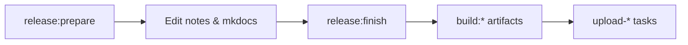

# Doing a Release

This guide describes how maintainers cut a new Thrive release. Releases use
[semantic versioning](https://semver.org/) (`X.Y.Z`). Git tags and GitHub
releases use a `v` prefix (for example `v1.3.4`).

You need [mise](https://mise.jdx.dev/) and the usual project setup (`mise run
install`, `mise run prepare`). Several steps also require credentials in
`secrets/Config.secrets` (GitHub CLI, Docker Hub, Apple, Google Play, and so on).

## Overview



1. **Prepare** — branch, bump version, scaffold release notes.
2. **Edit** — write notes and register them in the user docs site.
3. **Finish** — merge to `master`, tag, sync `develop`.
4. **Build** — produce binaries/images you plan to ship (optional per platform).
5. **Publish** — upload to GitHub, Docker Hub, and app stores as needed.

Not every release ships every platform. Desktop, mobile, and Docker uploads are
independent after `release:finish`.

## 1. Prepare

From the `develop` branch:

```bash
mise run release:prepare X.Y.Z
```

This:

- Pulls latest `develop`.
- Creates branch `release/X.Y.Z`.
- Sets `VERSION=X.Y.Z` in `src/Config.global`.
- Adds `src/docs/material/releases/version-X.Y.Z.md` from the release template.

Stay on the new `release/X.Y.Z` branch for the next steps.

## 2. Edit release files

Before finishing the release:

1. **Release notes** — edit
   `src/docs/material/releases/version-X.Y.Z.md` with what changed.
2. **User docs navigation** — add the new page under **Releases** in
   `src/docs/mkdocs.yml` (newest version at the top of the list).
3. **Any other release changes** — commit other fixes or version-specific
   updates on the release branch.

Generate stats attached to the GitHub release (required by `release:upload-gh`):

```bash
mise run build:stats-for-nerds
mise run build:stats-over-time
```

These write under `.build-cache/cloc/$VERSION/` (using `VERSION` from
`src/Config.global`).

## 3. Finish the release

When notes and version bumps are ready:

```bash
mise run release:finish
```

Run this on the `release/X.Y.Z` branch. It:

- Commits pending changes on the release branch.
- Squash-merges into `master` and tags `vX.Y.Z`.
- Pushes `master` and the tag.
- Merges `master` back into `develop` and pushes.
- Deletes the local release branch.

To abandon instead: `mise run release:abandon` (from the release branch).

## 4. Build artifacts

Build only what you plan to publish. All builds read `VERSION` from
`src/Config.global` (set during prepare).

| Artifact | Command | Used by |
| --- | --- | --- |
| Docker images (amd64 + arm64) | `mise run build:docker` (both platforms by default) | `release:upload-docker X.Y.Z` |
| macOS desktop (.dmg + Mac App Store .pkg) | `mise run build:desktop` | `release:upload-gh`, `release:upload-appstore-macos` |
| iOS (.ipa) | `mise run build:mobile-ios` | `release:upload-gh`, `release:upload-appstore-ios` |
| Android (.aab) | `mise run build:mobile-android` | `release:upload-gh`, `release:upload-playstore` |

Docker images are not uploaded to GitHub (they are too large). Publish them to
Docker Hub separately.

## 5. Publish

### GitHub release

Creates (or completes) a GitHub release for tag `vX.Y.Z`, uploads release notes,
`release-manifest.json`, cloc stats, self-hosted compose/nginx configs, and
optional platform binaries:

```bash
mise run release:upload-gh X.Y.Z
```

Include platform assets with flags when you built them:

```bash
mise run release:upload-gh X.Y.Z --desktop-macos
mise run release:upload-gh X.Y.Z --mobile-ios
mise run release:upload-gh X.Y.Z --mobile-android
```

You can combine flags in one invocation. The task starts as a draft and
publishes when uploads succeed.

### Docker Hub

After `mise run build:docker` (reads `VERSION` from `src/Config.global`; builds amd64
and arm64 unless you pass `--platform`). Docker reuses layer cache when nothing in the
build context changed since the last build — that is normal and usually what you want.
If you need a full rebuild (e.g. after bumping only `VERSION` with no code diff, or to
refresh base images), use `mise run build:docker --no-cache` and/or `--pull`:

```bash
mise run release:upload-docker X.Y.Z
```

`upload-docker` requires the version argument and refuses to run if it does not
match `VERSION` in `src/Config.global`. It also checks that each
`jupiter/<image>:${VERSION}-{amd64,arm64}` exists locally before pushing.

Pushes multi-arch manifests for `webapi-srv`, `api`, `mcp`, `webui`, `docs`,
`cli`, and all WebAPI cron images (`getthriving/...` on Docker Hub).

### App stores

Requires prior builds and credentials in `secrets/Config.secrets`.

| Platform | Command |
| --- | --- |
| iOS (App Store) | `mise run release:upload-appstore-ios X.Y.Z` |
| macOS (Mac App Store) | `mise run release:upload-appstore-macos X.Y.Z` |
| Android (Google Play) | `mise run release:upload-playstore X.Y.Z` |

After store review, update distribution status in the release manifest:

```bash
mise run release:adjust-distribution X.Y.Z --app-store ready ...
```

See `mise run release:adjust-distribution --help` for flags.

## Quick reference

| Step | Command |
| --- | --- |
| Start release | `mise run release:prepare X.Y.Z` |
| List tags | `mise run release:list` |
| Finish git side | `mise run release:finish` |
| GitHub release | `mise run release:upload-gh X.Y.Z [flags]` |
| Docker Hub | `mise run release:upload-docker X.Y.Z` |
| App Store (iOS) | `mise run release:upload-appstore-ios X.Y.Z` |
| App Store (macOS) | `mise run release:upload-appstore-macos X.Y.Z` |
| Google Play | `mise run release:upload-playstore X.Y.Z` |

## Related

- User-facing release notes are published under **Releases** on
  [docs.get-thriving.com](https://docs.get-thriving.com).
- The in-app “new release” banner reads `release-manifest.json` from GitHub
  releases (see `tasks/release/` for how it is generated).
- Background on release versioning and CD vs named releases: [Releases](README.md#releases)
  in the developer README.
