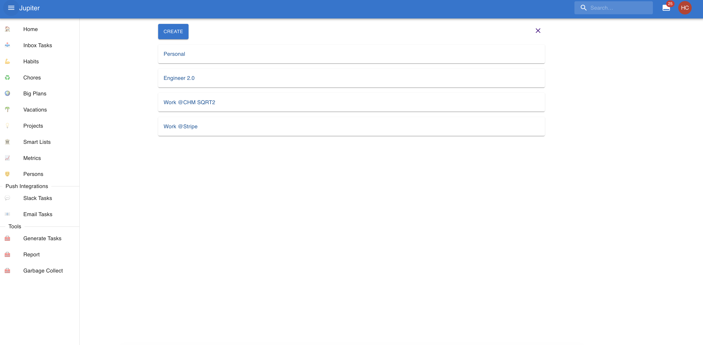

# Aspects

A _Aspect_ is a long-lived container for work. It acts as a label that
groups tasks, habits, chores, and big plans together, and connects the
day-to-day work of Thrive to the long-horizon thinking of the
[Life Plan](overview.md).

## Purpose

Aspects represent the major ongoing areas of your life — things like
_"Personal"_, _"Career"_, _"Health"_, or _"Family"_. They are not things
you finish; they are the contexts in which you operate over years or decades.

In most cases, a small number of aspects (one to five) is enough. Aspects
are meant to be very long-lived — think years, not months. For shorter,
more concrete pieces of work, use [big plans](../big-plans.md) instead.

## Properties

| Property | Description |
| -------- | ----------- |
| **Name** | A short label for the aspect. |
| **Parent Aspect** | An optional parent aspect, for hierarchies. |

Aspects also support a **note** for additional context and **tags** for
organisation.

## Aspect Hierarchy

Aspects can be nested within other aspects, forming a tree. The maximum
nesting depth is **5 levels** from the root.

For example:

- _Personal_
  - _Health_
  - _Family_
- _Career_
  - _Current Role_
  - _Side Aspects_

## Relationship to the Life Plan

Aspects live inside the Life Plan. They are referenced by
[chapters](chapters.md), [goals](goals.md), and [milestones](milestones.md),
making them the bridge between the Life Plan and your operational work.

Every task, habit, chore, and big plan can be tagged with a aspect.
This lets you see all work related to a given area of your life in one
place.

## Accessing Aspects

Open the **Life Plan** section from the sidebar, then choose **Aspects**
from the menu. You can also see aspects via `aspect-show` in the CLI.

An example:

