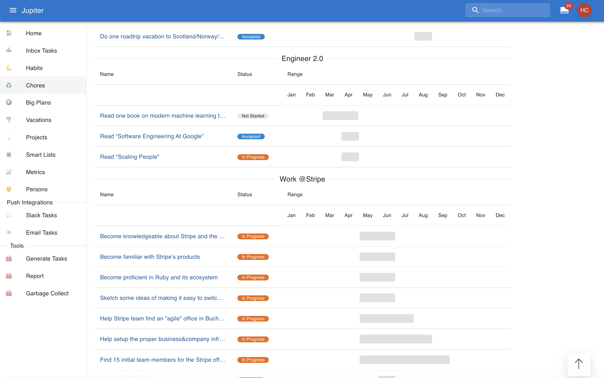
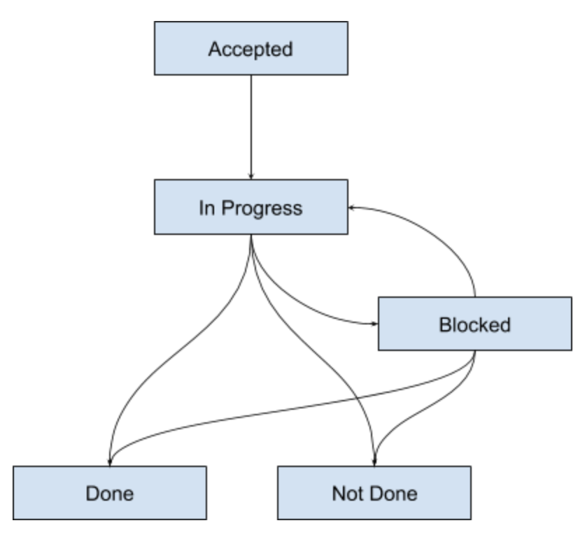

# Projects

Projects are larger units of work. They are made up of multiple tasks. Big
planslive in the "Project page". A project is ideal to model work which can be
donein anything from a week to several months, and which consists of multiple
steps.

For example, you can have a task like "Plan a family vacation", or "Get a
talkaccepted to a conference", or "Buy a new house".

## Properties

Projects have a _name, which should tell you what the task is all aboutl

Projects have a _status_, which can be one of:

* _Accepted_: all projects you create should start with this status. It means
  you're
  going to start working on this plan in the near to medium future.
* _In Progress_: all projects you're currently working on should be placed in
  this
  status. Once you start working on some tasks from the plan, it can be counted
  as being  in progress.
* _Blocked_: all projects that you're currently not able to push through for
  some reason.
  Either all tasks are blocked, or you can't start on any new ones, etc. It can
  move back  and forth to "In Progress", and then to "Not Done" or "Done".
* _Done_: the project is finished, with the desired outcome.
* _Not Done_: the project is finished, but not with the desired outcome.

In the project page, you can see projects in a sort of timeline board,
organised by aspect.

The state evolution diagram is:

Projects can be marked as _key projects_. This is first a user-level concept -
itmarks the project as an important one for you, that is absolutely necessary
to getright. In various other contexts it applies, helping with sorting,
prioritization, etc.

Projects have an actionable date, much like _inbox tasks_. Conceptually, this
is the thetime from which you can start working on a particular project.

Projects also have a deadline. It's optional, but it's strongly recommended you
add oneas a goal setting rule.

Any tasks that don't have their own actionable or due dates will inherit them
from the bigplan, if it has any.

Between them, the actionable and due dates allow you to schedule the projects
in time ina more organized manner. There is a special view which allows for
this.

## Milestones

Projects have milestones attached to them. These have a name and a date when
theyare recorded (either need to happen, or finish, etc.).

The milestone must occur before the start date and end date of the project
ifthese exist. Once milestones are added, the start and end date can only be
addedbefore the earliest milestone, or after the latest one, respectively.

## Stats

Projects have a notion of progress associated with them, which is quantified by
a numberranging from `0` to `100`.

* Projects that are not started are at `0`.
* Projects that are in progress or blocked are at `10` at a mimum and `95` at a
  maximum.
  If there are any inbox tasks associated with the plan, the progress is
  proportional to the  number of completed tasks (done or not done) relative to
  the total number of tasks.
* Projects that are in a completed state (done or not done) are at `100`
  progress.

This is a simple indicator of the progress done and yet do be done on a
particularpiece of work.

## Projects Page

The project page is a representation of your current and longer term work. It's
acollection of projects.

There are multiple views for the projects though right now:

* _Timeline by aspect_: organize projects as a Gantt chart split by aspect.
* _Timeline_: organize all projects as a Gnatt chart.
* _List_: view all projects as a long list of work, with limited sorting.

Besides the obvious button interactions, you can also _swipe left_ to mark a big
plan as _done_ and_swipe right_ to mark it as not done.

## Gamification

Projects participate in [gamification](gamification.md) if it is enabled. Every
planmarked as `Done` brings you number of points. Every task marked as `Not
Done` loses you a numberof points.
